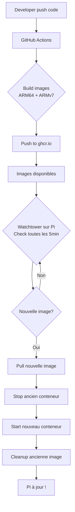

# 🍓 Déploiement sur Raspberry Pi

Guide complet pour déployer eLibrary sur votre Raspberry Pi.

## 🎯 Deux approches disponibles

### ⭐ Option A : Production (Recommandée)

**Utilise des images pré-buildées depuis GitHub Container Registry**

| Avantages | Inconvénients |
|-----------|---------------|
| ⚡ **Très rapide** : 2-3 min | Nécessite GitHub registry |
| 🔄 **Auto-update** : Watchtower | Téléchargement d'images (~1GB) |
| ❄️ **Pi reste froid** : Pas de build | - |
| 📦 **Versionné** : Tags git | - |
| 🔄 **Rollback facile** | - |
| 🎯 **Production-ready** | - |

**👉 Voir** : [`DEPLOYMENT-PROD.md`](DEPLOYMENT-PROD.md)

---

### Option B : Build Local (Développement)

**Build les images directement sur le Raspberry Pi**

| Avantages | Inconvénients |
|-----------|---------------|
| 🔒 Pas besoin de registry | ⏱️ **Très lent** : 30-60 min |
| 💰 Gratuit | 🔥 **Pi surchauffe** pendant le build |
| 🛠️ Modifications locales | 💾 Consomme beaucoup de RAM |
| - | ❌ Pas d'auto-update |
| - | ❌ Downtime pendant build |

**👉 Voir** : [`docker-compose.raspberry-pi.yml`](../docker-compose.raspberry-pi.yml)

---

## 🚀 Quick Start (Production - Recommandé)

### 1. Sur le Raspberry Pi

```bash
# Cloner le projet
git clone https://github.com/VOTRE_USERNAME/eLibrary.git
cd eLibrary

# Configurer l'environnement
cp raspberry-pi/env.example .env
nano .env

# ⚠️ IMPORTANT : Modifier GITHUB_REPOSITORY_OWNER avec votre username GitHub
```

### 2. Démarrer l'application

```bash
# Donner les permissions
chmod +x raspberry-pi/scripts/deploy-prod.sh

# Démarrer (télécharge les images pré-buildées)
./raspberry-pi/scripts/deploy-prod.sh start
```

**C'est tout !** Les images sont téléchargées et démarrées en 2-3 minutes. 🎉

### 3. Accéder aux services

| Service | URL |
|---------|-----|
| React Frontend | `http://RASPBERRY_PI_IP:3000` |
| Angular Frontend | `http://RASPBERRY_PI_IP:4200` |
| API Gateway | `http://RASPBERRY_PI_IP:5000` |
| Grafana | `http://RASPBERRY_PI_IP:3001` |

---

## 🔄 Auto-update (Watchtower)

**Comment ça marche ?**

1. Vous pushez du code sur GitHub
2. GitHub Actions build les images (~5 min)
3. Watchtower détecte la nouvelle image (vérifie toutes les 5 min)
4. Watchtower pull et redémarre automatiquement
5. **Votre Pi est à jour sans intervention !**

**Timeline totale** : ~12 minutes du push au déploiement

---

## 📚 Documentation

| Document | Description |
|----------|-------------|
| [`DEPLOYMENT-PROD.md`](DEPLOYMENT-PROD.md) | Guide détaillé production avec registry |
| [`CICD-SETUP.md`](CICD-SETUP.md) | Configuration GitHub Actions et SSH |
| [`TROUBLESHOOTING.md`](TROUBLESHOOTING.md) | Solutions aux problèmes courants |
| [`env.example`](env.example) | Template de configuration |

---

## 🛠️ Commandes utiles

```bash
# Démarrer l'application
./raspberry-pi/scripts/deploy-prod.sh start

# Voir le statut
./raspberry-pi/scripts/deploy-prod.sh status

# Voir les logs
./raspberry-pi/scripts/deploy-prod.sh logs

# Mettre à jour manuellement
./raspberry-pi/scripts/deploy-prod.sh update

# Voir les versions
./raspberry-pi/scripts/deploy-prod.sh version

# Arrêter
./raspberry-pi/scripts/deploy-prod.sh stop
```

---

## 🔧 Configuration avancée

### Changer de version

```bash
# Dans .env, modifier IMAGE_TAG
IMAGE_TAG=v1.2.0  # Au lieu de latest

# Redémarrer
./raspberry-pi/scripts/deploy-prod.sh update
```

### Utiliser la branche develop

```bash
# Dans .env
IMAGE_TAG=develop

# Les images de la branche develop seront utilisées
```

### Désactiver l'auto-update

```bash
# Arrêter Watchtower
docker stop elibrary-watchtower

# Ou le retirer du docker-compose
```

---

## 🎓 Pourquoi cette approche est professionnelle

### Utilisée par :
- ✅ Netflix, Uber, Spotify (microservices avec registry)
- ✅ Toutes les entreprises avec CI/CD moderne
- ✅ Kubernetes (même principe : pull d'images)

### Démontre :
- ✅ Connaissance des best practices DevOps
- ✅ Compréhension de l'architecture cloud-native
- ✅ Expérience avec CI/CD pipelines
- ✅ Gestion de containers en production
- ✅ Automatisation et infrastructure as code

### Pour un recruteur :
Cette approche montre que vous comprenez :
- La séparation build/runtime
- L'importance de la rapidité de déploiement
- Les pratiques de production réelles
- L'automatisation complète du workflow

---

## 💰 Coûts

### GitHub Container Registry
- **Repo public** : Gratuit et illimité
- **Repo privé** : 500MB gratuit, puis ~$0.25/GB/mois

### Alternatives gratuites
- Docker Hub (repo public gratuit)
- Self-hosted registry (nécessite serveur supplémentaire)

---

## 🔄 Workflow complet



---

Félicitations ! Vous avez une infrastructure professionnelle digne d'une startup ! 🚀

